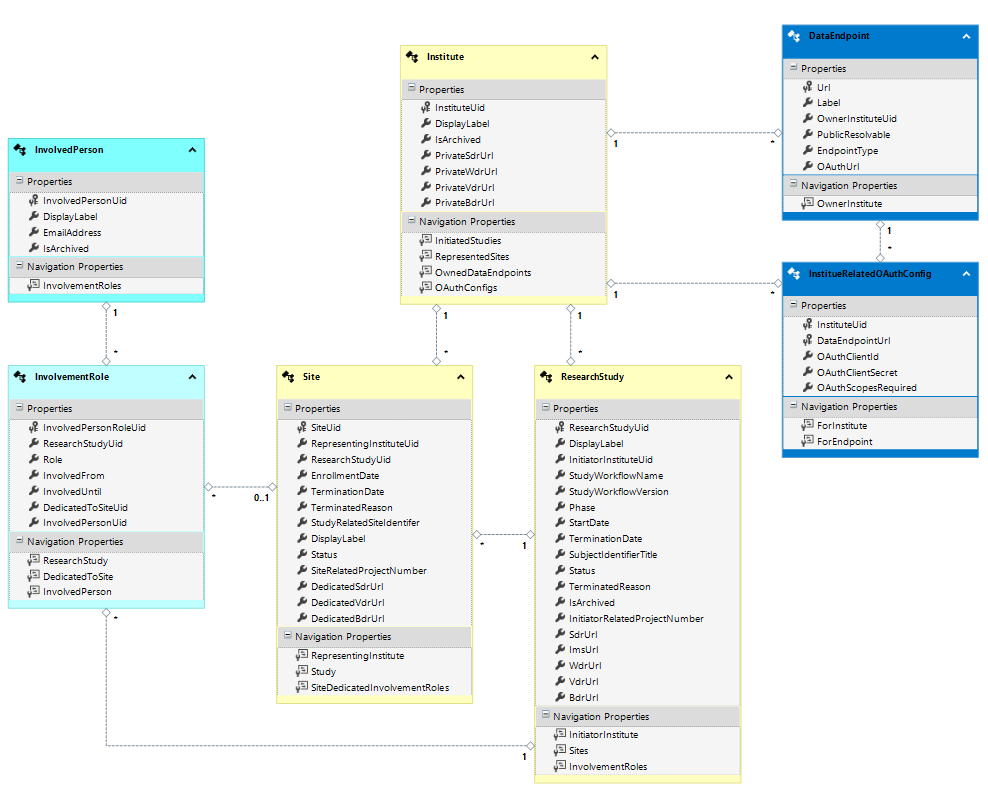

# ORSCF-StudyManagement Schema Specification

|          | Info                                    |
|----------|-----------------------------------------|
|author:   |[ORSCF](https://www.orscf.org) ("Open Research Study Communication Formats") / T.Korn|
|license:  |[Apache-2](https://choosealicense.com/licenses/apache-2.0/)|
|version:  |2.0.0|
|timestamp:|2024-11-03 00:00|

### Contents

  * .  [DataEndpoint](#DataEndpoint)
  * .  [InstitueRelatedOAuthConfig](#InstitueRelatedOAuthConfig)
  * .  [Institute](#Institute)
  * .  [InvolvedPerson](#InvolvedPerson)
  * .  [ResearchStudy](#ResearchStudy)
  * ........\  [InvolvementRole](#InvolvementRole)
  * ........\  [Site](#Site)

# Model:

## DataEndpoint

### Fields

| Name | Type | Required | Fix |
| ---- | ---- | -------- | --- |
| [Url](#DataEndpointUrl-Field) **(PK)** | *string* | YES | no |
| Label | *string* | YES | no |
| [OwnerInstituteUid](#DataEndpointOwnerInstituteUid-Field) (FK) | *guid* | YES | no |
| PublicResolvable | *boolean* | YES | no |
| [EndpointType](#DataEndpointEndpointType-Field) | *string* | YES | no |
| OAuthUrl | *string* | YES | no |
#### Unique Keys
* Url **(primary)**

#### DataEndpoint.**Url** (Field)
* this field represents the identity (PK) of the record

#### DataEndpoint.**OwnerInstituteUid** (Field)
* this field is used as foreign key to address the related 'OwnerInstitute'

#### DataEndpoint.**EndpointType** (Field)

SDR | WDR | IMS | VDR | BDR | <CustomName>

### Relations

| Navigation-Name | Role | Target-Type | Target-Multiplicity |
| --------------- | -----| ----------- | ------------------- |
| [OwnerInstitute](#OwnerInstitute-lookup-from-this-DataEndpoint) | Lookup | [Institute](#Institute) | 0/1 (optional) |

##### **OwnerInstitute** (lookup from this DataEndpoint)
Target Type: [Institute](#Institute)
Addressed by: [OwnerInstituteUid](#DataEndpointOwnerInstituteUid-Field).

## InstitueRelatedOAuthConfig

### Fields

| Name | Type | Required | Fix |
| ---- | ---- | -------- | --- |
| [InstituteUid](#InstitueRelatedOAuthConfigInstituteUid-Field) **(PK)** (FK) | *guid* | YES | no |
| [DataEndpointUrl](#InstitueRelatedOAuthConfigDataEndpointUrl-Field) **(PK)** (FK) | *string* | YES | no |
| OAuthClientId | *string* | YES | no |
| OAuthClientSecret | *string* | YES | no |
| OAuthScopesRequired | *string* | YES | no |
#### Unique Keys
* InstituteUid + DataEndpointUrl **(primary)**

#### InstitueRelatedOAuthConfig.**InstituteUid** (Field)
* this field represents the identity (PK) of the record
* this field is used as foreign key to address the related 'ForInstitute'

#### InstitueRelatedOAuthConfig.**DataEndpointUrl** (Field)
* this field represents the identity (PK) of the record
* this field is used as foreign key to address the related 'ForEndpoint'

### Relations

| Navigation-Name | Role | Target-Type | Target-Multiplicity |
| --------------- | -----| ----------- | ------------------- |
| [ForInstitute](#ForInstitute-lookup-from-this-InstitueRelatedOAuthConfig) | Lookup | [Institute](#Institute) | 0/1 (optional) |
| [ForEndpoint](#ForEndpoint-lookup-from-this-InstitueRelatedOAuthConfig) | Lookup | [DataEndpoint](#DataEndpoint) | 0/1 (optional) |

##### **ForInstitute** (lookup from this InstitueRelatedOAuthConfig)
Target Type: [Institute](#Institute)
Addressed by: [InstituteUid](#InstitueRelatedOAuthConfigInstituteUid-Field).
##### **ForEndpoint** (lookup from this InstitueRelatedOAuthConfig)
Target Type: [DataEndpoint](#DataEndpoint)
Addressed by: [DataEndpointUrl](#InstitueRelatedOAuthConfigDataEndpointUrl-Field).

## Institute

### Fields

| Name | Type | Required | Fix |
| ---- | ---- | -------- | --- |
| [InstituteUid](#InstituteInstituteUid-Field) **(PK)** | *guid* | YES | no |
| [DisplayLabel](#InstituteDisplayLabel-Field) | *string* (100) | YES | no |
| IsArchived | *boolean* | YES | no |
| [PrivateSdrUrl](#InstitutePrivateSdrUrl-Field) | *string* | no | no |
| [PrivateWdrUrl](#InstitutePrivateWdrUrl-Field) | *string* | no | no |
| [PrivateVdrUrl](#InstitutePrivateVdrUrl-Field) | *string* | no | no |
| [PrivateBdrUrl](#InstitutePrivateBdrUrl-Field) | *string* | no | no |
#### Unique Keys
* InstituteUid **(primary)**

#### Institute.**InstituteUid** (Field)

An [Universally Unique Identifier](https://de.wikipedia.org/wiki/Universally_Unique_Identifier) which can be generated by any origin system and is used to address this ORSCF conform data record in decentralized environments. Note that this Identity must not be changed any more!

* this field represents the identity (PK) of the record

#### Institute.**DisplayLabel** (Field)

An DisplayLabel which is dedicated for the usage within the frontend of study managent software. Note that this short name representation hat the caracter of an internal shortcurt and could be ambiguous. The usage for legal-relevant/official communication or documents is not recommended, as well as the usage for technical identification of this record.

* the maximum length of the content within this field is 100 characters.

#### Institute.**PrivateSdrUrl** (Field)
* this field is optional, so that '*null*' values are supported

#### Institute.**PrivateWdrUrl** (Field)
* this field is optional, so that '*null*' values are supported

#### Institute.**PrivateVdrUrl** (Field)
* this field is optional, so that '*null*' values are supported

#### Institute.**PrivateBdrUrl** (Field)
* this field is optional, so that '*null*' values are supported

### Relations

| Navigation-Name | Role | Target-Type | Target-Multiplicity |
| --------------- | -----| ----------- | ------------------- |
| [OwnedDataEndpoints](#OwnedDataEndpoints-refering-to-this-Institute) | Referers | [DataEndpoint](#DataEndpoint) | * (multiple) |
| [OAuthConfigs](#OAuthConfigs-refering-to-this-Institute) | Referers | [InstitueRelatedOAuthConfig](#InstitueRelatedOAuthConfig) | * (multiple) |
| [InitiatedStudies](#InitiatedStudies-refering-to-this-Institute) | Referers | [ResearchStudy](#ResearchStudy) | * (multiple) |
| [RepresentedSites](#RepresentedSites-refering-to-this-Institute) | Referers | [Site](#Site) | * (multiple) |

##### **OwnedDataEndpoints** (refering to this Institute)
Target: [DataEndpoint](#DataEndpoint)
##### **OAuthConfigs** (refering to this Institute)
Target: [InstitueRelatedOAuthConfig](#InstitueRelatedOAuthConfig)
##### **InitiatedStudies** (refering to this Institute)
Target: [ResearchStudy](#ResearchStudy)
##### **RepresentedSites** (refering to this Institute)
Target: [Site](#Site)

## InvolvedPerson

### Fields

| Name | Type | Required | Fix |
| ---- | ---- | -------- | --- |
| [InvolvedPersonUid](#InvolvedPersonInvolvedPersonUid-Field) **(PK)** | *guid* | YES | no |
| [DisplayLabel](#InvolvedPersonDisplayLabel-Field) | *string* | no | no |
| [EmailAddress](#InvolvedPersonEmailAddress-Field) | *guid* | no | no |
| IsArchived | *boolean* | YES | no |
#### Unique Keys
* InvolvedPersonUid **(primary)**

#### InvolvedPerson.**InvolvedPersonUid** (Field)

An [Universally Unique Identifier](https://de.wikipedia.org/wiki/Universally_Unique_Identifier) which can be generated by any origin system and is used to address this ORSCF conform data record in decentralized environments. Note that this Identity must not be changed any more!

* this field represents the identity (PK) of the record

#### InvolvedPerson.**DisplayLabel** (Field)
* this field is optional, so that '*null*' values are supported

#### InvolvedPerson.**EmailAddress** (Field)
* this field is optional, so that '*null*' values are supported

### Relations

| Navigation-Name | Role | Target-Type | Target-Multiplicity |
| --------------- | -----| ----------- | ------------------- |
| [InvolvementRoles](#InvolvementRoles-refering-to-this-InvolvedPerson) | Referers | [InvolvementRole](#InvolvementRole) | * (multiple) |

##### **InvolvementRoles** (refering to this InvolvedPerson)
Target: [InvolvementRole](#InvolvementRole)

## ResearchStudy

entity, which relates to [HL7.ResearchStudy](https://www.hl7.org/fhir/researchstudy.html)
### Fields

| Name | Type | Required | Fix |
| ---- | ---- | -------- | --- |
| [ResearchStudyUid](#ResearchStudyResearchStudyUid-Field) **(PK)** | *guid* | YES | no |
| [DisplayLabel](#ResearchStudyDisplayLabel-Field) | *string* (100) | YES | no |
| [InitiatorInstituteUid](#ResearchStudyInitiatorInstituteUid-Field) (FK) | *guid* | YES | no |
| StudyWorkflowName | *string* | YES | no |
| StudyWorkflowVersion | *string* | YES | no |
| [Phase](#ResearchStudyPhase-Field) | *string* | no | no |
| [StartDate](#ResearchStudyStartDate-Field) | *datetime* | no | no |
| [TerminationDate](#ResearchStudyTerminationDate-Field) | *datetime* | no | no |
| [SubjectIdentifierTitle](#ResearchStudySubjectIdentifierTitle-Field) | *string* | YES | no |
| [Status](#ResearchStudyStatus-Field) | *string* | YES | no |
| [TerminatedReason](#ResearchStudyTerminatedReason-Field) | *string* | no | no |
| IsArchived | *boolean* | YES | no |
| [InitiatorRelatedProjectNumber](#ResearchStudyInitiatorRelatedProjectNumber-Field) | *string* | no | no |
| [SdrUrl](#ResearchStudySdrUrl-Field) | *string* | no | no |
| [ImsUrl](#ResearchStudyImsUrl-Field) | *string* | no | no |
| [WdrUrl](#ResearchStudyWdrUrl-Field) | *string* | no | no |
| [VdrUrl](#ResearchStudyVdrUrl-Field) | *string* | no | no |
| [BdrUrl](#ResearchStudyBdrUrl-Field) | *string* | no | no |
#### Unique Keys
* ResearchStudyUid **(primary)**

#### ResearchStudy.**ResearchStudyUid** (Field)

An [Universally Unique Identifier](https://de.wikipedia.org/wiki/Universally_Unique_Identifier) which can be generated by any origin system and is used to address this ORSCF conform data record in decentralized environments. Note that this Identity must not be changed any more!

* this field represents the identity (PK) of the record

#### ResearchStudy.**DisplayLabel** (Field)

An DisplayLabel which is dedicated for the usage within the frontend of study managent software. Note that this short name representation hat the caracter of an internal shortcurt and could be ambiguous. The usage for legal-relevant/official communication or documents is not recommended, as well as the usage for technical identification of this record.

* the maximum length of the content within this field is 100 characters.

#### ResearchStudy.**InitiatorInstituteUid** (Field)
* this field is used as foreign key to address the related 'InitiatorInstitute'

#### ResearchStudy.**Phase** (Field)

AS DECLARED BY [HL7.ResearchStudyPhase](https://www.hl7.org/fhir/valueset-research-study-phase.html):
n-a | early-phase-1 | phase-1 | phase-1-phase-2 | phase-2 | phase-2-phase-3 | phase-3 | phase-4

* this field is optional, so that '*null*' values are supported

#### ResearchStudy.**StartDate** (Field)

a estimated date in future is possible

* this field is optional, so that '*null*' values are supported

#### ResearchStudy.**TerminationDate** (Field)

a estimated date in future is possible

* this field is optional, so that '*null*' values are supported

#### ResearchStudy.**SubjectIdentifierTitle** (Field)

A title which informs about the sematic of the SubjectIdentifer (which concrete value is used): "Randomization-Number", "Screening-Number", ...

#### ResearchStudy.**Status** (Field)

AS DECLARED BY [HL7.ResearchStudyStatus](https://www.hl7.org/fhir/valueset-research-study-status.html):
active | administratively-completed | approved | closed-to-accrual | closed-to-accrual-and-intervention | completed | disapproved | in-review | temporarily-closed-to-accrual | temporarily-closed-to-accrual-and-intervention | withdrawn

#### ResearchStudy.**TerminatedReason** (Field)
* this field is optional, so that '*null*' values are supported

#### ResearchStudy.**InitiatorRelatedProjectNumber** (Field)
* this field is optional, so that '*null*' values are supported

#### ResearchStudy.**SdrUrl** (Field)

usually provided by the Sponsor

* this field is optional, so that '*null*' values are supported

#### ResearchStudy.**ImsUrl** (Field)

usually provided by the Sponsor

* this field is optional, so that '*null*' values are supported

#### ResearchStudy.**WdrUrl** (Field)

usually provided by the Sponsor

* this field is optional, so that '*null*' values are supported

#### ResearchStudy.**VdrUrl** (Field)

usually provided by the Sponsor

* this field is optional, so that '*null*' values are supported

#### ResearchStudy.**BdrUrl** (Field)

usually provided by the Sponsor

* this field is optional, so that '*null*' values are supported

### Relations

| Navigation-Name | Role | Target-Type | Target-Multiplicity |
| --------------- | -----| ----------- | ------------------- |
| [InitiatorInstitute](#InitiatorInstitute-lookup-from-this-ResearchStudy) | Lookup | [Institute](#Institute) | 0/1 (optional) |
| [InvolvementRoles](#InvolvementRoles-childs-of-this-ResearchStudy) | Childs | [InvolvementRole](#InvolvementRole) | * (multiple) |
| [Sites](#Sites-childs-of-this-ResearchStudy) | Childs | [Site](#Site) | * (multiple) |

##### **InitiatorInstitute** (lookup from this ResearchStudy)
Target Type: [Institute](#Institute)
Addressed by: [InitiatorInstituteUid](#ResearchStudyInitiatorInstituteUid-Field).
##### **InvolvementRoles** (childs of this ResearchStudy)
Target: [InvolvementRole](#InvolvementRole)
##### **Sites** (childs of this ResearchStudy)
Target: [Site](#Site)

## InvolvementRole

### Fields

| Name | Type | Required | Fix |
| ---- | ---- | -------- | --- |
| [InvolvedPersonRoleUid](#InvolvementRoleInvolvedPersonRoleUid-Field) **(PK)** | *guid* | YES | no |
| [ResearchStudyUid](#InvolvementRoleResearchStudyUid-Field) (FK) | *guid* | YES | no |
| [Role](#InvolvementRoleRole-Field) | *string* | no | no |
| [InvolvedFrom](#InvolvementRoleInvolvedFrom-Field) | *datetime* | no | no |
| [InvolvedUntil](#InvolvementRoleInvolvedUntil-Field) | *datetime* | no | no |
| [DedicatedToSiteUid](#InvolvementRoleDedicatedToSiteUid-Field) (FK) | *guid* | no | no |
| [InvolvedPersonUid](#InvolvementRoleInvolvedPersonUid-Field) (FK) | *guid* | YES | no |
#### Unique Keys
* InvolvedPersonRoleUid **(primary)**

#### InvolvementRole.**InvolvedPersonRoleUid** (Field)

An [Universally Unique Identifier](https://de.wikipedia.org/wiki/Universally_Unique_Identifier) which can be generated by any origin system and is used to address this ORSCF conform data record in decentralized environments. Note that this Identity must not be changed any more!

* this field represents the identity (PK) of the record

#### InvolvementRole.**ResearchStudyUid** (Field)
* this field is used as foreign key to address the related 'ResearchStudy'

#### InvolvementRole.**Role** (Field)
* this field is optional, so that '*null*' values are supported

#### InvolvementRole.**InvolvedFrom** (Field)
* this field is optional, so that '*null*' values are supported

#### InvolvementRole.**InvolvedUntil** (Field)
* this field is optional, so that '*null*' values are supported

#### InvolvementRole.**DedicatedToSiteUid** (Field)

null indicated a site independent global role

* this field is optional, so that '*null*' values are supported
* this field is used as foreign key to address the related 'DedicatedToSite'

#### InvolvementRole.**InvolvedPersonUid** (Field)
* this field is used as foreign key to address the related 'InvolvedPerson'

### Relations

| Navigation-Name | Role | Target-Type | Target-Multiplicity |
| --------------- | -----| ----------- | ------------------- |
| [InvolvedPerson](#InvolvedPerson-lookup-from-this-InvolvementRole) | Lookup | [InvolvedPerson](#InvolvedPerson) | 0/1 (optional) |
| [ResearchStudy](#ResearchStudy-parent-of-this-InvolvementRole) | Parent | [ResearchStudy](#ResearchStudy) | 0/1 (optional) |
| [DedicatedToSite](#DedicatedToSite-lookup-from-this-InvolvementRole) | Lookup | [Site](#Site) | 1 (required) |

##### **InvolvedPerson** (lookup from this InvolvementRole)
Target Type: [InvolvedPerson](#InvolvedPerson)
Addressed by: [InvolvedPersonUid](#InvolvementRoleInvolvedPersonUid-Field).
##### **ResearchStudy** (parent of this InvolvementRole)
Target Type: [ResearchStudy](#ResearchStudy)
Addressed by: [ResearchStudyUid](#InvolvementRoleResearchStudyUid-Field).
##### **DedicatedToSite** (lookup from this InvolvementRole)
Target Type: [Site](#Site)
Addressed by: [DedicatedToSiteUid](#InvolvementRoleDedicatedToSiteUid-Field).

## Site

### Fields

| Name | Type | Required | Fix |
| ---- | ---- | -------- | --- |
| [SiteUid](#SiteSiteUid-Field) **(PK)** | *guid* | YES | no |
| [RepresentingInstituteUid](#SiteRepresentingInstituteUid-Field) (FK) | *guid* | YES | no |
| [ResearchStudyUid](#SiteResearchStudyUid-Field) (FK) | *guid* | YES | no |
| [EnrollmentDate](#SiteEnrollmentDate-Field) | *datetime* | no | no |
| [TerminationDate](#SiteTerminationDate-Field) | *datetime* | no | no |
| [TerminatedReason](#SiteTerminatedReason-Field) | *string* | no | no |
| [StudyRelatedSiteIdentifer](#SiteStudyRelatedSiteIdentifer-Field) | *string* | YES | no |
| [DisplayLabel](#SiteDisplayLabel-Field) | *string* | YES | no |
| [Status](#SiteStatus-Field) | *string* | YES | no |
| [SiteRelatedProjectNumber](#SiteSiteRelatedProjectNumber-Field) | *string* | no | no |
| [DedicatedSdrUrl](#SiteDedicatedSdrUrl-Field) | *string* | no | no |
| [DedicatedVdrUrl](#SiteDedicatedVdrUrl-Field) | *string* | no | no |
| [DedicatedBdrUrl](#SiteDedicatedBdrUrl-Field) | *string* | no | no |
#### Unique Keys
* SiteUid **(primary)**

#### Site.**SiteUid** (Field)

An [Universally Unique Identifier](https://de.wikipedia.org/wiki/Universally_Unique_Identifier) which can be generated by any origin system and is used to address this ORSCF conform data record in decentralized environments. Note that this Identity must not be changed any more!

* this field represents the identity (PK) of the record

#### Site.**RepresentingInstituteUid** (Field)

[Universally Unique Identifier](https://de.wikipedia.org/wiki/Universally_Unique_Identifier) of the institute, which is representing this site

* this field is used as foreign key to address the related 'RepresentingInstitute'

#### Site.**ResearchStudyUid** (Field)

[Universally Unique Identifier](https://de.wikipedia.org/wiki/Universally_Unique_Identifier) of the related record

* this field is used as foreign key to address the related 'Study'

#### Site.**EnrollmentDate** (Field)

a estimated date in future is possible

* this field is optional, so that '*null*' values are supported

#### Site.**TerminationDate** (Field)

a estimated date in future is possible

* this field is optional, so that '*null*' values are supported

#### Site.**TerminatedReason** (Field)
* this field is optional, so that '*null*' values are supported

#### Site.**StudyRelatedSiteIdentifer** (Field)

Offical 'SiteIdentifier' which is unique within the scope of the related study

#### Site.**DisplayLabel** (Field)

An DisplayLabel which is dedicated for the usage within the frontend of study managent software. Note that this short name representation hat the caracter of an internal shortcurt and could be ambiguous. The usage for legal-relevant/official communication or documents is not recommended, as well as the usage for technical identification of this record.

#### Site.**Status** (Field)

AS DECLARED BY HL7

#### Site.**SiteRelatedProjectNumber** (Field)
* this field is optional, so that '*null*' values are supported

#### Site.**DedicatedSdrUrl** (Field)
* this field is optional, so that '*null*' values are supported

#### Site.**DedicatedVdrUrl** (Field)
* this field is optional, so that '*null*' values are supported

#### Site.**DedicatedBdrUrl** (Field)
* this field is optional, so that '*null*' values are supported

### Relations

| Navigation-Name | Role | Target-Type | Target-Multiplicity |
| --------------- | -----| ----------- | ------------------- |
| [RepresentingInstitute](#RepresentingInstitute-lookup-from-this-Site) | Lookup | [Institute](#Institute) | 0/1 (optional) |
| [SiteDedicatedInvolvementRoles](#SiteDedicatedInvolvementRoles-refering-to-this-Site) | Referers | [InvolvementRole](#InvolvementRole) | * (multiple) |
| [Study](#Study-parent-of-this-Site) | Parent | [ResearchStudy](#ResearchStudy) | 0/1 (optional) |

##### **RepresentingInstitute** (lookup from this Site)
Target Type: [Institute](#Institute)
Addressed by: [RepresentingInstituteUid](#SiteRepresentingInstituteUid-Field).
##### **SiteDedicatedInvolvementRoles** (refering to this Site)
Target: [InvolvementRole](#InvolvementRole)
##### **Study** (parent of this Site)
Target Type: [ResearchStudy](#ResearchStudy)
Addressed by: [ResearchStudyUid](#SiteResearchStudyUid-Field).

